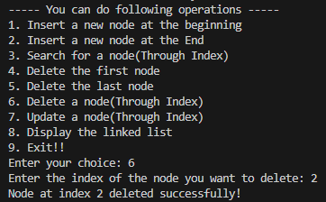

<h1>OUTPUTS...</h1>
 
<h2>LINKED LIST</h2>
 
<h3>0. Start & End</h3>
 

 
<h3>1. Insert At Begining</h3>
 

 
<h3>2. Insert At End</h3>
 

 
<h3>3. Search(Index) </h3>
 

 
<h3>4. Delete Front</h3>
 

 
<h3>5. Delete Back</h3>
 

 
<h3>6. Delete (index)</h3>
 

 
<h3>7. Update</h3>
 

 
<h3>8. Display</h3>
 

 
<h2>SORTING & SEARCH</h2>
 
<h3>0. Start & End</h3>
 

 
<h3>1. Marge Sort</h3>
 

 
<h3>2. Quick Sort</h3>
 

 
<h3>3. Binary Search</h3>
 

 