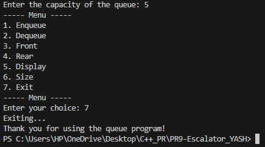
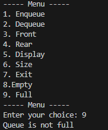

<h1>OUTPUTS...</h1>
 
<h3>Entry & Exit</h3>
<h4>Stack : </h4>

<h4>Queue : </h4>

 
<h3>Push & Enqueue</h3>
<h4>Stack : </h4>

<h4>Queue : </h4>

 
<h3>Pop & Dequeue</h3>
<h4>Stack : </h4>

<h4>Queue : </h4>

 
<h3>Top & Front</h3>
<h4>Stack : </h4>

<h4>Queue : </h4>

 
<h3>Empty</h3>
<h4>Stack : </h4>

<h4>Queue : </h4>

 
<h3>Full</h3>
<h4>Stack : </h4>

<h4>Queue : </h4>

 